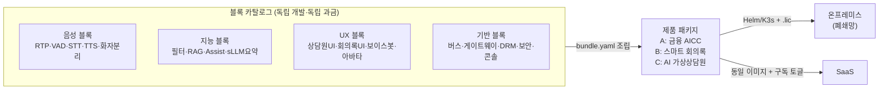

# VisionAI — 온프레미스/SaaS 하이브리드 음성 AI 플랫폼 (레고블록 모듈 아키텍처)

> 주식회사 링버스(LNKBUS) · B2B 설계/기획 문서 v2.0 · 2026-08
> 기준 사양: 「온프레미스 실시간 다국어 STT/TTS & sLLM AI 플랫폼 개발 사양서 v1.0」

## 프로젝트 개요

**VisionAI**는 폐쇄망(Air-Gapped) 온프레미스와 SaaS 양쪽으로 공급 가능한
**엔터프라이즈 실시간 음성/텍스트 AI 플랫폼**이다.

- 핵심 도메인: **금융 AICC**(실시간 상담원 지원) + **공공 스마트 회의록**
- 실시간 다국어 STT/TTS, Micro-Rule 컴플라이언스 필터, sLLM 기반 실시간 TA(Agent Assist)/RAG
  지식 팝업, 자동 요약 파이프라인을 단일 플랫폼으로 제공
- 향후 **AI 가상상담원(아바타 상담)**으로 확장

### 핵심 아키텍처 전략

1. **레고블록 모듈(Composable & Billable Blocks)** — 모든 컴포넌트는 독립 배포·조립 가능한
   블록이며, 동시에 **견적서 라인 아이템·라이선스 게이팅 단위**다. 블록 조합(bundle)으로
   제품 패키지(AICC / 회의록 / 가상상담원)를 구성하고, 업셀은 라이선스 파일 재발급으로 완결
2. **Model-Agnostic 어댑터** — STT(Faster-Whisper↔Triton), TTS(CosyVoice/Kokoro),
   sLLM(vLLM↔상용 API)을 코드 수정 없이 핫스왑
3. **Dual-Profile + Sub-Second** — AICC(초저지연 Stereo/RTP)와 회의록(고정밀 Mono/File)
   동시 지원, STT→RAG 지식 팝업까지 1초 미만
4. **Complete Air-Gapped** — H/W Fingerprint 오프라인 DRM, KCMVP 암호화, 외부 호출 0건.
   동일 코드가 SaaS에서는 상용 API Provider로 동작

## 문서 구성

| 문서 | 내용 |
|------|------|
| [**00. 레고블록 모듈 카탈로그**](docs/00-module-catalog.md) | **단일 기준 문서** — 블록 정의·계약·조립 레시피·블록별 청구 모델 |
| [01. 제품 기획서](docs/01-product-plan.md) | 시장/타겟, 패키지 상품화, 가격·라이선스 모델, 로드맵 |
| [02. 시스템 아키텍처](docs/02-architecture.md) | End-to-End 구조, 실시간 파이프라인, 어댑터, 프로토콜 |
| [03. 배포 전략 (온프렘/SaaS)](docs/03-deployment-onprem-saas.md) | 에어갭 번들, K3s/Compose, 오프라인 DRM, 업데이트 |
| [04. AI 가상상담원 확장 설계](docs/04-ai-avatar-counselor.md) | 아바타 파이프라인, WebRTC, 단계별 구현 |
| [05. 데이터·보안·컴플라이언스](docs/05-data-security-compliance.md) | 망분리·KCMVP·개인정보·AI 리스크 통제 |
| [06. 기술 스택 & MVP 개발 계획](docs/06-tech-stack-mvp.md) | 블록 모노레포 구조, Wave별 개발 계획 — **코딩 착수용** |

## 현재 구현 상태 (Wave 1~4 진행)

**고객이 질문하면 1초 안에 상담원 화면에 근거 팝업이 뜬다** — 사양서의 핵심 경로가 동작한다.

```
마이크 → VAD → STT → 컴플라이언스 필터(<10ms) → 질의 추출(SLM)
      → 하이브리드 검색(Dense+BM25) → 리랭킹 → 지식 팝업
```

| 블록 | 역할 | 상태 |
|------|------|------|
| `CORE-BUS` | 세션 레지스트리, 이벤트 버스 배선, Dual-Profile 컨텍스트 | ✅ |
| `CORE-GW` | JWT 인증, `/v1/audio/stream` WebSocket(사양서 §4), 데모 페이지 | ✅ |
| `AUD-VAD` | 발화 구간 분할(패딩·interim·행오버), VAD 어댑터(energy/silero) | ✅ |
| `STT-CORE` | `BaseSTTAdapter` ABC, fake/Faster-Whisper 어댑터 핫스왑 | ✅ |
| `FLT-MICRO` | PII 마스킹 + 컴플라이언스 룰 체크 (Fast-Path <10ms) | ✅ |
| `RAG-KB` | 조항 경계를 존중하는 청킹, 임베딩, 색인, 문서 파기 | ✅ |
| `RAG-SRCH` | Qdrant Dense + BM25 Sparse RRF 융합, 리랭킹 | ✅ |
| `TA-ASSIST` | 맥락 기반 질의 추출 → 검색 → 지식 팝업 (1초 예산) | ✅ |
| `LLM-GW` | vLLM/상용 API 추상화, 프로파일별 모델 분기, 토큰 계측 | ✅ |
| `LLM-SUM` | 세션 종료 배치 요약 (AICC 표준요약 / 회의록·Action Item) | ✅ |
| `SCN-STUDIO` | **저작·학습 콘솔** — 룰 저작·즉시테스트·배포, STT 사전, 검색 튜닝, 평가셋, 채택률 | ✅ |
| `AUD-RTP`·`UI-AGENT`·`UI-MEET` | 전화 인입, 상담원/회의록 화면 | Wave 4~5 |

### 고객사가 직접 운영하는 화면 (`SCN-STUDIO`)

온프레미스 B2B에서 룰 한 줄 바꾸는 데 공급사 인력이 필요하면 유지보수 원가가
라이선스 수익을 잠식한다. 그래서 저작 도구는 부가 기능이 아니라 수익성의 전제다.

| 화면 | 하는 일 |
|------|---------|
| 컴플라이언스 룰 | 초안 편집 → **실제 필터 블록으로 즉시 테스트** → 배포 → 이력에서 되돌리기 |
| STT 사전 | 상품명·전문용어 등록 (범용 STT가 확실히 틀리는 고유명사 교정) |
| 검색 튜닝 | 질의를 넣어 Dense/Sparse/리랭킹 **점수 분해** 확인 — "왜 이 문서가 안 나오지"를 직접 진단 |
| 평가셋 | 골든셋으로 Recall@K·지연 측정 — 튜닝 전후 비교가 추측이 되지 않게 |
| 팝업 채택률 | 상담원이 실제로 썼는지 집계 + 개선 대상 질의 목록 |

`make up` 후 <http://localhost:8090/console>. 룰은 **초안 → 배포**를 명시적으로
거쳐야 반영되므로, 편집 중인 정규식이 상담 파이프라인에 새어 나가지 않는다.

```bash
make install          # uv 워크스페이스 동기화
make check            # 린트 · 블록 경계 · 타입 · 테스트 · 카탈로그 검증
make up && make demo  # compose 기동 → http://localhost:8080/demo
```

테스트는 **GPU도 Redis도 없이** 파이프라인 전체를 검증한다(인메모리 버스 + fake/hashing 어댑터).
Redis가 있으면 블록들을 실제 프로세스로 띄우는 스택 스모크 테스트까지 함께 돈다.

레고블록 원칙은 문서상의 약속이 아니라 CI 게이트다 — `import-linter`가 블록 간 직접
import, 계층 역전, 서비스 로직의 엔진 직접 참조, 상담 경로에서의 외부 SDK 사용을
차단하고, `blockctl check`가 매니페스트·의존·토픽 생산자·청구 단위 정합성을 검사한다.

## 빠른 이해를 위한 그림 한 장


