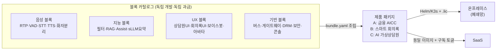

# VisionAI — 온프레미스/SaaS 하이브리드 음성 AI 플랫폼 (레고블록 모듈 아키텍처)

> 주식회사 링버스(LNKBUS) · B2B 설계/기획 문서 v2.0 · 2026-08
> 기준 사양: 「온프레미스 실시간 다국어 STT/TTS & sLLM AI 플랫폼 개발 사양서 v1.0」

## 프로젝트 개요

**VisionAI**는 폐쇄망(Air-Gapped) 온프레미스와 SaaS 양쪽으로 공급 가능한
**엔터프라이즈 실시간 음성/텍스트 AI 플랫폼**이다.

- 핵심 도메인: **금융 AICC**(실시간 상담원 지원) + **공공 스마트 회의록**
- 실시간 다국어 STT/TTS, Micro-Rule 컴플라이언스 필터, sLLM 기반 실시간 TA(Agent Assist)/RAG
  지식 팝업, 자동 요약 파이프라인을 단일 플랫폼으로 제공
- 향후 **AI 가상상담원(아바타 상담)**으로 확장

### 핵심 아키텍처 전략

1. **레고블록 모듈(Composable & Billable Blocks)** — 모든 컴포넌트는 독립 배포·조립 가능한
   블록이며, 동시에 **견적서 라인 아이템·라이선스 게이팅 단위**다. 블록 조합(bundle)으로
   제품 패키지(AICC / 회의록 / 가상상담원)를 구성하고, 업셀은 라이선스 파일 재발급으로 완결
2. **Model-Agnostic 어댑터** — STT(Faster-Whisper↔Triton), TTS(CosyVoice/Kokoro),
   sLLM(vLLM↔상용 API)을 코드 수정 없이 핫스왑
3. **Dual-Profile + Sub-Second** — AICC(초저지연 Stereo/RTP)와 회의록(고정밀 Mono/File)
   동시 지원, STT→RAG 지식 팝업까지 1초 미만
4. **Complete Air-Gapped** — H/W Fingerprint 오프라인 DRM, KCMVP 암호화, 외부 호출 0건.
   동일 코드가 SaaS에서는 상용 API Provider로 동작

## 문서 구성

| 문서 | 내용 |
|------|------|
| [**00. 레고블록 모듈 카탈로그**](docs/00-module-catalog.md) | **단일 기준 문서** — 블록 정의·계약·조립 레시피·블록별 청구 모델 |
| [01. 제품 기획서](docs/01-product-plan.md) | 시장/타겟, 패키지 상품화, 가격·라이선스 모델, 로드맵 |
| [02. 시스템 아키텍처](docs/02-architecture.md) | End-to-End 구조, 실시간 파이프라인, 어댑터, 프로토콜 |
| [03. 배포 전략 (온프렘/SaaS)](docs/03-deployment-onprem-saas.md) | 에어갭 번들, K3s/Compose, 오프라인 DRM, 업데이트 |
| [04. AI 가상상담원 확장 설계](docs/04-ai-avatar-counselor.md) | 아바타 파이프라인, WebRTC, 단계별 구현 |
| [05. 데이터·보안·컴플라이언스](docs/05-data-security-compliance.md) | 망분리·KCMVP·개인정보·AI 리스크 통제 |
| [06. 기술 스택 & MVP 개발 계획](docs/06-tech-stack-mvp.md) | 블록 모노레포 구조, Wave별 개발 계획 — **코딩 착수용** |

## 빠른 이해를 위한 그림 한 장

