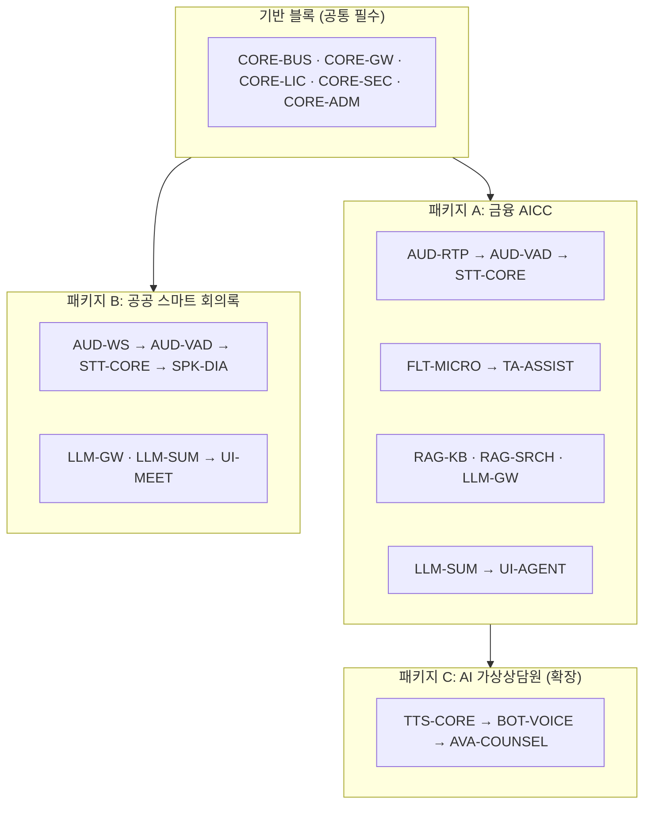

# 00. 레고블록 모듈 카탈로그 (Module Catalog & Billing Units)

> 본 문서가 플랫폼의 **단일 기준 카탈로그**다. 모든 개발·견적·라이선스·배포는 여기 정의된
> 블록(Block) 단위로 관리한다. 블록 추가/변경 시 이 문서를 먼저 갱신한다.

## 1. 레고블록 원칙 (Block Contract)

모든 블록은 다음 5가지를 반드시 갖춘다. 이 계약을 지키면 어떤 블록이든 조립·교체·개별 판매가 가능하다.

| # | 계약 요소 | 내용 |
|---|-----------|------|
| 1 | **독립 배포 단위** | 블록 = 컨테이너 이미지 1개 이상 + Helm 서브차트(또는 compose 프로파일). 단독 기동/중지 가능 |
| 2 | **표준 인터페이스** | 동기: OpenAPI(REST/WebSocket) · 비동기: 이벤트 버스 토픽. 블록 간 직접 import 금지 — 공유는 `libs/` 아래 명시적으로 올린 것만(계약·런타임 인프라·검색 인프라) |
| 3 | **어댑터 교체성** | 내부 모델/엔진은 Abstract Base Class 어댑터로 감싼다(예: STT의 Faster-Whisper ↔ Triton 핫스왑) |
| 4 | **라이선스 게이팅** | 블록 활성화 여부·용량(채널 수 등)은 `.lic` 파일의 블록 플래그로 제어 — 코드 재배포 없이 개통 |
| 5 | **청구 단위(Billing Unit)** | 블록마다 ①구축 개발비(견적 항목) ②라이선스 단가 ③유지보수율이 정의됨 |

```
[블록 물리 구조]
blocks/<block-id>/
├── src/                  # 서비스 코드 (표준 계약 외 노출 금지)
├── adapters/             # 교체 가능한 엔진 어댑터 (플러그인)
├── contracts/            # openapi.yaml / asyncapi.yaml / 이벤트 스키마
├── chart/                # Helm 서브차트
├── block.yaml            # 블록 매니페스트: id, version, 의존 블록, 라이선스 키, 과금 단위
└── tests/
```

### 조립 방식

- 블록 간 실시간 데이터는 **이벤트 버스**(Redis Streams, 대규모 시 NATS 승격)의 표준 토픽으로 흐른다:
  `audio.in` → `stt.delta` → `filter.clean` → `assist.popup` / `session.closed` → `summary.done`
- 제품 패키지 = `bundle.yaml`(블록 목록 + values 오버레이) 하나로 정의 → 설치기가 해당 블록만 반입/기동
- 새 채널·새 엔진은 **블록 추가**로 대응하며 기존 블록 수정은 발생하지 않아야 한다 (개방-폐쇄 원칙)

## 2. 블록 카탈로그

### 2.1 기반 블록 (Foundation) — 모든 패키지 필수

| ID | 블록명 | 기능 | 주요 기술 | 개발 규모(참고) |
|----|--------|------|-----------|----------------|
| `CORE-BUS` | 세션 오케스트레이터 & 이벤트 버스 | 세션 수명주기, 블록 간 이벤트 라우팅, Dual-Profile(AICC/회의록) 컨텍스트 | FastAPI, Redis Streams | 2.0 MM |
| `CORE-GW` | API/WS 게이트웨이 | 인증(JWT/SSO), 테넌트 라우팅, `/v1/audio/stream` WebSocket 프로토콜 | FastAPI, OIDC | 1.5 MM |
| `CORE-LIC` | 오프라인 DRM 라이선스 | H/W Fingerprint(GPU UUID+CPU Serial+MAC, SHA-256) 검증, RSA-4096 `.lic`, 블록 플래그·동시 채널 수 게이팅 | 자체 구현 | 1.5 MM |
| `CORE-SEC` | 암호화·감사 | KCMVP 검증모듈 연동(ARIA/AES-256), append-only 감사로그, PII 접근통제 | KCMVP 모듈 | 1.5 MM |
| `CORE-ADM` | 운영 콘솔 | 테넌트/사용자/권한, 블록 상태·GPU 자원 모니터링, 세션 이력 조회, 통계 대시보드, 라이선스 현황 | Next.js, Prometheus | 3.0 MM |

### 2.2 음성 블록 (Speech)

| ID | 블록명 | 기능 | 주요 기술 | 개발 규모(참고) |
|----|--------|------|-----------|----------------|
| `AUD-RTP` | SIP/RTP 인입 게이트웨이 | AICC 전화망 스트림 수신(G.711/PCM 8k/16k Stereo), 채널 분리(고객/상담원) | SIP/RTP 스택 | 2.5 MM |
| `AUD-WS` | WS/gRPC/파일 인입 | 회의·앱 오디오 수신(16kHz+ Mono/Multi), 파일 업로드 배치 | WebSocket, gRPC | 1.0 MM |
| `AUD-VAD` | 오디오 라우터 & 버퍼 | Silero VAD, 200~500ms 청크 분할, 백프레셔 관리 | Silero VAD | 1.5 MM |
| `STT-CORE` | STT 어댑터 프레임워크 | `BaseSTTAdapter` ABC + Faster-Whisper 기본 어댑터, 스트리밍 Delta 출력, 다국어 | Faster-Whisper | 2.5 MM |
| `STT-TRT` | 고성능 STT 서빙 (애드온) | Triton Inference Server 어댑터 — 대규모 동시 채널용 핫스왑 | Triton | 1.5 MM |
| `SPK-DIA` | 화자분리 (애드온) | 회의록 프로필용 diarization, 화자 라벨링 | pyannote 계열 | 1.5 MM |
| `TTS-CORE` | TTS 어댑터 프레임워크 | `BaseTTSAdapter` ABC + CosyVoice/Kokoro 어댑터, 200ms 청크 스트리밍 합성 | CosyVoice, Kokoro | 2.0 MM |

### 2.3 텍스트 지능 블록 (Intelligence)

| ID | 블록명 | 기능 | 주요 기술 | 개발 규모(참고) |
|----|--------|------|-----------|----------------|
| `FLT-MICRO` | Micro-Filter & 컴플라이언스 | Fast-Path(<10ms): 정규식+로컬 NER PII 마스킹, 필수 고지문구 발화 체크 | Regex/C++, NER | 1.5 MM |
| `RAG-KB` | 지식베이스 수집기 | HWP/PDF/DOCX 파서, 청킹, 임베딩 파이프라인, 문서 버전 관리 | 한국어 임베딩 모델 | 2.0 MM |
| `RAG-SRCH` | 하이브리드 검색 & 리랭킹 | Qdrant(Dense) + BM25(Sparse) 동시 검색(<100ms), BGE-Reranker(<80ms) | Qdrant, BGE | 2.0 MM |
| `TA-ASSIST` | 실시간 Agent Assist | SLM(1.5~3B) Query Extractor(<200ms) → 검색 → 지식 팝업/추천 답변 push(<50ms). 전체 1초 미만 | vLLM(SLM) | 2.5 MM |
| `LLM-GW` | sLLM 서빙 게이트웨이 | vLLM(7B~14B INT4/FP8) 서빙, 모델 프로파일 관리, (SaaS: 상용 API Provider) | vLLM | 1.5 MM |
| `LLM-SUM` | 요약 & 분석 | 세션 종료 배치: AICC 카테고리 분류·표준 요약, 회의록·안건·Action Item 추출 | vLLM | 2.0 MM |

### 2.4 저작·학습 블록 (Authoring & Learning)

**고객사가 스스로 운영할 수 있게 하는 블록들이다.** 이게 없으면 룰 한 줄, 상품명 하나
바꾸는 데도 링버스 인력이 투입되어 유지보수 원가가 라이선스 수익을 잠식한다.
온프레미스 B2B에서 이 계층은 선택이 아니라 수익성의 전제다.

| ID | 블록명 | 기능 | 주요 기술 | 개발 규모(참고) |
|----|--------|------|-----------|----------------|
| `ADM-KB` | 지식 관리 스튜디오 | 문서 업로드·버전 관리·색인 상태 추적, 청킹 결과 미리보기, **검색 튜닝 콘솔**(질의 입력 → Dense/Sparse/리랭킹 점수 분해 표시) | Next.js | 2.0 MM |
| `SCN-STUDIO` | 시나리오·룰 스튜디오 | ① 컴플라이언스 룰 저작(정규식 빌더 + **즉시 테스트**) ② 상담 시나리오 흐름 저작(분기·조건·기간계 액션 호출) ③ 시나리오 시뮬레이터(가상 대화로 흐름 검증) ④ 프롬프트 버전 관리 | Next.js, 플로우 에디터 | 4.0 MM |
| `LRN-STUDIO` | 학습·품질 스튜디오 | ① **STT 커스텀 사전**(상품명·전문용어·사명 등록 → 인식 교정) ② 평가셋(골든셋) 관리·실행·리포트 ③ 상담원 피드백 수집(팝업 채택/거부) → 재학습 데이터 적재 ④ 오인식·오검색 사례 큐 | Next.js, 평가 파이프라인 | 3.5 MM |
| `MLO-MODEL` | 모델 운영 (애드온) | 모델 버전 등록·전환·롤백, A/B 비교, GPU 배치 프로파일 관리, 반입 모델 무결성 검증 | vLLM/Triton 연동 | 2.0 MM |

> **왜 별도 블록인가**: ① 부분 도입 고객(예: 컴플라이언스 필터만 구매)은 `SCN-STUDIO`만
> 필요하고 `LRN-STUDIO`는 불필요하다 ② 저작 도구는 상담 실시간 경로와 부하 특성이 완전히
> 달라 같은 프로세스에 둘 이유가 없다 ③ 애드온 과금으로 업셀 경로가 생긴다.

### 2.5 UX/채널 블록 (Experience)

| ID | 블록명 | 기능 | 주요 기술 | 개발 규모(참고) |
|----|--------|------|-----------|----------------|
| `UI-AGENT` | 상담원 워크스페이스 | 실시간 자막, 지식 팝업, 컴플라이언스 경고, 상담 요약 확인 | Next.js, WS | 2.5 MM |
| `UI-MEET` | 스마트 회의록 UI | 실시간 회의 자막(화자별), 회의록 편집·확정, 안건/Action Item 보드 | Next.js | 2.0 MM |
| `BOT-VOICE` | 보이스봇 (애드온) | STT+TTS+대화 시나리오로 인·아웃바운드 자동 응대 | TTS-CORE 조합 | 3.0 MM |
| `AVA-COUNSEL` | AI 가상상담원 (애드온) | 아바타 립싱크·표정, WebRTC 화상, 키오스크 모드 ([04 문서](04-ai-avatar-counselor.md)) | WebRTC/SFU, 렌더러 | 6.0 MM+ |

> 개발 규모(MM)는 견적 산정용 참고치(초기 구축 기준)이며, 고객 커스터마이징은 별도 항목으로 가산한다.

## 3. 제품 패키지 (블록 조립 레시피)



| 패키지 | 구성 블록 | 타겟 |
|--------|-----------|------|
| **A. 금융 AICC** | 기반 5 + AUD-RTP, AUD-VAD, STT-CORE, FLT-MICRO, RAG-KB, RAG-SRCH, TA-ASSIST, LLM-GW, LLM-SUM, UI-AGENT + **ADM-KB, SCN-STUDIO**(운영 필수) | 금융사 콜센터 (실시간 상담원 지원) |
| **B. 스마트 회의록** | 기반 5 + AUD-WS, AUD-VAD, STT-CORE, SPK-DIA, LLM-GW, LLM-SUM, UI-MEET + **LRN-STUDIO**(용어 사전) | 공공기관·기업 회의록 자동화 |
| **A+B 통합** | A ∪ B (STT/VAD/LLM 블록 공유 — 중복 비용 없음) | 금융지주·대형 공공 |
| **C. AI 가상상담원** | A + TTS-CORE, BOT-VOICE, AVA-COUNSEL | 무인창구·키오스크·화상상담 |
| **개별 블록 판매** | 예: STT-CORE 단독(타사 시스템에 STT API 공급), FLT-MICRO 단독(기존 콜인프라에 컴플라이언스만) | 부분 도입 고객 |

## 4. 블록별 청구 모델 (Billing)

### 4.1 과금 축 3가지

| 축 | 내용 | 적용 |
|----|------|------|
| **① 구축 개발비** | 블록별 MM 참고치 × MM 단가 = 견적서 라인 아이템. 커스터마이징(기간계 연동, 전용 룰셋)은 별도 라인 | 온프렘 최초 구축, 애드온 추가 |
| **② 라이선스** | 블록별 단가 × 용량 단위. 용량 단위는 블록 성격에 따름 (아래 표) | 온프렘 연간/영구, `.lic` 게이팅 |
| **③ 유지보수** | 라이선스 합계의 15~20%/년 (릴리스 트레인 + 기술지원) | 온프렘 |

SaaS는 동일 카탈로그를 **요금제 모듈 토글**로 재사용: 패키지 = 플랜, 애드온 블록 = 추가 구독.

### 4.2 블록별 라이선스 용량 단위

| 블록 | 용량 단위 | 예 |
|------|-----------|-----|
| AUD-RTP, STT-CORE, TA-ASSIST | **동시 채널 수**(Concurrent Channel) | 50ch / 100ch / 300ch 티어 |
| SPK-DIA, LLM-SUM | 월 처리 시간(오디오 hour) 또는 무제한 티어 | 500h/월 |
| TTS-CORE, BOT-VOICE | 동시 합성 스트림 수 | 20 스트림 |
| AVA-COUNSEL | 동시 아바타 세션 수 | 10 세션 |
| RAG-KB, RAG-SRCH | 문서 수/인덱스 크기 티어 | ~10만 청크 |
| UI-AGENT | 상담원 시트 수 | 100석 |
| ADM-KB, SCN-STUDIO, LRN-STUDIO | 편집자(에디터) 시트 수 | 5석 / 20석 |
| MLO-MODEL | 관리 모델 수 | 5개 |
| 기반 블록 | 패키지에 포함 (별도 미과금) | — |

### 4.3 견적서 표준 템플릿 (예: 금융 AICC 100채널)

| 구분 | 항목 | 산정 | 
|------|------|------|
| 개발 | 기반 블록 셋업 (CORE-*) | 표준 구축 고정가 |
| 개발 | AICC 패키지 블록 구축 (블록별 MM 합산) | MM × 단가 |
| 개발 | 고객 커스터마이징 (기간계 연동 어댑터, 전용 컴플라이언스 룰) | 별도 산정 |
| 라이선스 | STT-CORE 100ch + TA-ASSIST 100ch + UI-AGENT 100석 + ... | 블록 단가표 |
| 인프라 | GPU 서버 권고 사양 제시 (고객 조달) | — |
| 유지보수 | 라이선스 합계 × 18% / 년 | — |

### 4.4 `.lic` 파일과 카탈로그의 연결

구현된 형식(`licgen`이 발급하고 모든 블록이 검증한다):

```json
{
  "payload": {
    "format": 1,
    "customer_id": "cust_hyundai_001",
    "site": "본사",
    "issued_on": "2026-08-05",
    "expires": "2027-12-31",
    "key_id": "default",
    "algorithm": "RSA-4096/PSS-SHA256",
    "fingerprint": {
      "combined": "9ed402af...",
      "components": { "gpu": "sha256...", "cpu": "sha256...", "machine": "sha256...", "mac": "sha256..." }
    },
    "blocks": {
      "STT-CORE":    { "enabled": true, "concurrent_channels": 100 },
      "TA-ASSIST":   { "enabled": true, "concurrent_channels": 100 },
      "FLT-MICRO":   { "enabled": true },
      "LLM-SUM":     { "enabled": true, "audio_hours_monthly": 1000 },
      "UI-AGENT":    { "enabled": true, "seats": 100 },
      "AVA-COUNSEL": { "enabled": false }
    }
  },
  "signature": "<base64 RSA-4096/PSS-SHA256>",
  "key_id": "default"
}
```

- 라이선스 = 카탈로그 블록 ID의 부분집합 + 용량. **업셀 = `.lic` 재발급**만으로 완결(재설치 불필요)
- `payload`만 서명 대상이다. 정규화 규칙(`sort_keys`, 공백 제거, `ensure_ascii=False`)을
  발급기와 검증기가 **같은 함수**로 공유한다 — 갈라지면 이미 나간 라이선스가 전부 깨진다
- **블록별 용량은 `blockctl list`의 청구 단위와 같은 이름을 쓴다.** 견적서 라인 아이템이
  그대로 라이선스 필드가 되므로 계약과 실행이 어긋나지 않는다

#### 폐쇄망 발급 절차 (구현됨)

```
① 설치 서버   CORE-LIC  POST /internal/v1/license/request  → acme.req (H/W 지문 해시)
② USB 반출    acme.req  →  공급사 발급 서버
③ 발급 서버   licgen issue acme.req --key license_key.pem --expires ... --block ... → acme.lic
④ USB 반입    acme.lic  →  설치 서버
⑤ 설치 서버   CORE-LIC  POST /internal/v1/license  → 검증 후 원자적 설치
```

- **call-home 없음.** 망분리 환경에서 외부 통신 시도 자체가 보안 심사 감점이고 애초에 나가지도 못한다
- **라이선스 서버 없음.** 모든 블록이 같은 `.lic`을 읽어 각자 검증한다 — 중앙 검증 서버는
  폐쇄망에서 가장 피해야 할 단일 장애점이다
- **지문은 N-of-M.** 부품(GPU/CPU/machine-id/MAC)별 해시를 남겨 2개 이상 일치하면 통과한다.
  NIC 교체 한 번에 서비스가 멈추는 것을 막으면서 다른 서버로의 복제는 거부한다
- **개인키는 제품에 들어가지 않는다.** 공개키만 릴리스 빌드가 내장하고, 개인키는 발급 서버에만 둔다
- 만료는 30일 유예 후 차단, **지문 불일치는 유예 없이 즉시 거부**(복제 방지가 DRM의 존재 이유)
- CORE-LIC만 라이선스 없이 기동한다. 설치기가 라이선스를 요구하면 최초 구축에서
  아무도 설치할 수 없고, 만료로 멈춘 현장에는 교체 라이선스를 넣을 창구가 사라진다

## 5. 블록 개발 순서와 의존 관계

```
Wave 1 (필수 뼈대):  CORE-BUS → CORE-GW → CORE-LIC(스텁)                    ✅ 완료
Wave 2 (음성 코어):  AUD-WS → AUD-VAD → STT-CORE                           ✅ 완료 (실시간 자막 데모)
Wave 3 (지능):       FLT-MICRO → RAG-KB → RAG-SRCH → TA-ASSIST → LLM-GW    ✅ 완료 (1초 지식 팝업)
Wave 4 (제품화 A):   LLM-SUM + ADM-KB/SCN-STUDIO + UI-AGENT + AUD-RTP   ← AICC 패키지 완성
                     (저작 도구를 여기 넣는 이유: PoC 단계부터 고객사가 자기 약관·룰을
                      직접 넣어 봐야 도입 판단이 가능하다. 데모용 하드코딩으로는 계약이 안 된다)
Wave 5 (제품화 B):   SPK-DIA + UI-MEET                     ← 회의록 패키지 완성
Wave 5.5 (품질 운영): LRN-STUDIO + MLO-MODEL               ← 고객사 자립 운영 체계
Wave 6 (패키징):     CORE-LIC ✅ + CORE-SEC ✅ + CORE-ADM ✅ + 번들 ✅ + Helm ✅ + 릴리스 ✅
Wave 7 (확장):       TTS-CORE → BOT-VOICE → AVA-COUNSEL
```

블록 매니페스트(`blocks/*/block.yaml`)가 이 카탈로그의 기계 판독 형태다.
`blockctl list` / `blockctl effort`로 현재 구현된 블록의 청구 단위와 개발 규모 합계를
언제든 뽑을 수 있다 — 견적서 라인 아이템이 문서와 코드에서 갈라지지 않게 하기 위해서다.

- 각 Wave 종료 시점 = **청구 가능한 산출물 단위**(블록 인수 테스트 통과 기준) — 개발 용역으로 수주 시 마일스톤 검수·기성 청구 지점과 일치시킨다
