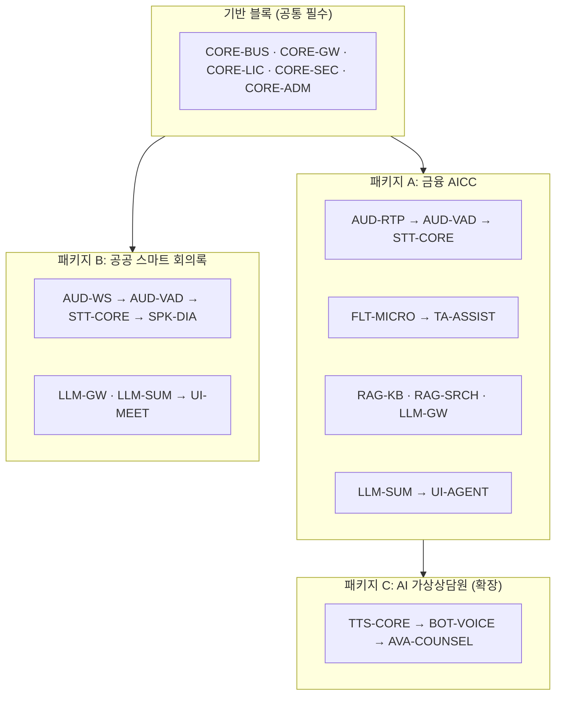

# 00. 레고블록 모듈 카탈로그 (Module Catalog & Billing Units)

> 본 문서가 플랫폼의 **단일 기준 카탈로그**다. 모든 개발·견적·라이선스·배포는 여기 정의된
> 블록(Block) 단위로 관리한다. 블록 추가/변경 시 이 문서를 먼저 갱신한다.

## 1. 레고블록 원칙 (Block Contract)

모든 블록은 다음 5가지를 반드시 갖춘다. 이 계약을 지키면 어떤 블록이든 조립·교체·개별 판매가 가능하다.

| # | 계약 요소 | 내용 |
|---|-----------|------|
| 1 | **독립 배포 단위** | 블록 = 컨테이너 이미지 1개 이상 + Helm 서브차트(또는 compose 프로파일). 단독 기동/중지 가능 |
| 2 | **표준 인터페이스** | 동기: OpenAPI(REST/WebSocket) · 비동기: 이벤트 버스 토픽(AsyncAPI 스키마). 블록 간 직접 import 금지 |
| 3 | **어댑터 교체성** | 내부 모델/엔진은 Abstract Base Class 어댑터로 감싼다(예: STT의 Faster-Whisper ↔ Triton 핫스왑) |
| 4 | **라이선스 게이팅** | 블록 활성화 여부·용량(채널 수 등)은 `.lic` 파일의 블록 플래그로 제어 — 코드 재배포 없이 개통 |
| 5 | **청구 단위(Billing Unit)** | 블록마다 ①구축 개발비(견적 항목) ②라이선스 단가 ③유지보수율이 정의됨 |

```
[블록 물리 구조]
blocks/<block-id>/
├── src/                  # 서비스 코드 (표준 계약 외 노출 금지)
├── adapters/             # 교체 가능한 엔진 어댑터 (플러그인)
├── contracts/            # openapi.yaml / asyncapi.yaml / 이벤트 스키마
├── chart/                # Helm 서브차트
├── block.yaml            # 블록 매니페스트: id, version, 의존 블록, 라이선스 키, 과금 단위
└── tests/
```

### 조립 방식

- 블록 간 실시간 데이터는 **이벤트 버스**(Redis Streams, 대규모 시 NATS 승격)의 표준 토픽으로 흐른다:
  `audio.in` → `stt.delta` → `filter.clean` → `assist.popup` / `session.closed` → `summary.done`
- 제품 패키지 = `bundle.yaml`(블록 목록 + values 오버레이) 하나로 정의 → 설치기가 해당 블록만 반입/기동
- 새 채널·새 엔진은 **블록 추가**로 대응하며 기존 블록 수정은 발생하지 않아야 한다 (개방-폐쇄 원칙)

## 2. 블록 카탈로그

### 2.1 기반 블록 (Foundation) — 모든 패키지 필수

| ID | 블록명 | 기능 | 주요 기술 | 개발 규모(참고) |
|----|--------|------|-----------|----------------|
| `CORE-BUS` | 세션 오케스트레이터 & 이벤트 버스 | 세션 수명주기, 블록 간 이벤트 라우팅, Dual-Profile(AICC/회의록) 컨텍스트 | FastAPI, Redis Streams | 2.0 MM |
| `CORE-GW` | API/WS 게이트웨이 | 인증(JWT/SSO), 테넌트 라우팅, `/v1/audio/stream` WebSocket 프로토콜 | FastAPI, OIDC | 1.5 MM |
| `CORE-LIC` | 오프라인 DRM 라이선스 | H/W Fingerprint(GPU UUID+CPU Serial+MAC, SHA-256) 검증, RSA-4096 `.lic`, 블록 플래그·동시 채널 수 게이팅 | 자체 구현 | 1.5 MM |
| `CORE-SEC` | 암호화·감사 | KCMVP 검증모듈 연동(ARIA/AES-256), append-only 감사로그, PII 접근통제 | KCMVP 모듈 | 1.5 MM |
| `CORE-ADM` | 관리자 콘솔 & MLOps | 테넌트/사용자/블록 상태, GPU 자원 모니터링, 지식 등록 UI, 통계 | Next.js, Prometheus | 3.0 MM |

### 2.2 음성 블록 (Speech)

| ID | 블록명 | 기능 | 주요 기술 | 개발 규모(참고) |
|----|--------|------|-----------|----------------|
| `AUD-RTP` | SIP/RTP 인입 게이트웨이 | AICC 전화망 스트림 수신(G.711/PCM 8k/16k Stereo), 채널 분리(고객/상담원) | SIP/RTP 스택 | 2.5 MM |
| `AUD-WS` | WS/gRPC/파일 인입 | 회의·앱 오디오 수신(16kHz+ Mono/Multi), 파일 업로드 배치 | WebSocket, gRPC | 1.0 MM |
| `AUD-VAD` | 오디오 라우터 & 버퍼 | Silero VAD, 200~500ms 청크 분할, 백프레셔 관리 | Silero VAD | 1.5 MM |
| `STT-CORE` | STT 어댑터 프레임워크 | `BaseSTTAdapter` ABC + Faster-Whisper 기본 어댑터, 스트리밍 Delta 출력, 다국어 | Faster-Whisper | 2.5 MM |
| `STT-TRT` | 고성능 STT 서빙 (애드온) | Triton Inference Server 어댑터 — 대규모 동시 채널용 핫스왑 | Triton | 1.5 MM |
| `SPK-DIA` | 화자분리 (애드온) | 회의록 프로필용 diarization, 화자 라벨링 | pyannote 계열 | 1.5 MM |
| `TTS-CORE` | TTS 어댑터 프레임워크 | `BaseTTSAdapter` ABC + CosyVoice/Kokoro 어댑터, 200ms 청크 스트리밍 합성 | CosyVoice, Kokoro | 2.0 MM |

### 2.3 텍스트 지능 블록 (Intelligence)

| ID | 블록명 | 기능 | 주요 기술 | 개발 규모(참고) |
|----|--------|------|-----------|----------------|
| `FLT-MICRO` | Micro-Filter & 컴플라이언스 | Fast-Path(<10ms): 정규식+로컬 NER PII 마스킹, 필수 고지문구 발화 체크 | Regex/C++, NER | 1.5 MM |
| `RAG-KB` | 지식베이스 수집기 | HWP/PDF/DOCX 파서, 청킹, 임베딩 파이프라인, 문서 버전 관리 | 한국어 임베딩 모델 | 2.0 MM |
| `RAG-SRCH` | 하이브리드 검색 & 리랭킹 | Qdrant(Dense) + BM25(Sparse) 동시 검색(<100ms), BGE-Reranker(<80ms) | Qdrant, BGE | 2.0 MM |
| `TA-ASSIST` | 실시간 Agent Assist | SLM(1.5~3B) Query Extractor(<200ms) → 검색 → 지식 팝업/추천 답변 push(<50ms). 전체 1초 미만 | vLLM(SLM) | 2.5 MM |
| `LLM-GW` | sLLM 서빙 게이트웨이 | vLLM(7B~14B INT4/FP8) 서빙, 모델 프로파일 관리, (SaaS: 상용 API Provider) | vLLM | 1.5 MM |
| `LLM-SUM` | 요약 & 분석 | 세션 종료 배치: AICC 카테고리 분류·표준 요약, 회의록·안건·Action Item 추출 | vLLM | 2.0 MM |

### 2.4 UX/채널 블록 (Experience)

| ID | 블록명 | 기능 | 주요 기술 | 개발 규모(참고) |
|----|--------|------|-----------|----------------|
| `UI-AGENT` | 상담원 워크스페이스 | 실시간 자막, 지식 팝업, 컴플라이언스 경고, 상담 요약 확인 | Next.js, WS | 2.5 MM |
| `UI-MEET` | 스마트 회의록 UI | 실시간 회의 자막(화자별), 회의록 편집·확정, 안건/Action Item 보드 | Next.js | 2.0 MM |
| `BOT-VOICE` | 보이스봇 (애드온) | STT+TTS+대화 시나리오로 인·아웃바운드 자동 응대 | TTS-CORE 조합 | 3.0 MM |
| `AVA-COUNSEL` | AI 가상상담원 (애드온) | 아바타 립싱크·표정, WebRTC 화상, 키오스크 모드 ([04 문서](04-ai-avatar-counselor.md)) | WebRTC/SFU, 렌더러 | 6.0 MM+ |

> 개발 규모(MM)는 견적 산정용 참고치(초기 구축 기준)이며, 고객 커스터마이징은 별도 항목으로 가산한다.

## 3. 제품 패키지 (블록 조립 레시피)



| 패키지 | 구성 블록 | 타겟 |
|--------|-----------|------|
| **A. 금융 AICC** | 기반 5 + AUD-RTP, AUD-VAD, STT-CORE, FLT-MICRO, RAG-KB, RAG-SRCH, TA-ASSIST, LLM-GW, LLM-SUM, UI-AGENT | 금융사 콜센터 (실시간 상담원 지원) |
| **B. 스마트 회의록** | 기반 5 + AUD-WS, AUD-VAD, STT-CORE, SPK-DIA, LLM-GW, LLM-SUM, UI-MEET | 공공기관·기업 회의록 자동화 |
| **A+B 통합** | A ∪ B (STT/VAD/LLM 블록 공유 — 중복 비용 없음) | 금융지주·대형 공공 |
| **C. AI 가상상담원** | A + TTS-CORE, BOT-VOICE, AVA-COUNSEL | 무인창구·키오스크·화상상담 |
| **개별 블록 판매** | 예: STT-CORE 단독(타사 시스템에 STT API 공급), FLT-MICRO 단독(기존 콜인프라에 컴플라이언스만) | 부분 도입 고객 |

## 4. 블록별 청구 모델 (Billing)

### 4.1 과금 축 3가지

| 축 | 내용 | 적용 |
|----|------|------|
| **① 구축 개발비** | 블록별 MM 참고치 × MM 단가 = 견적서 라인 아이템. 커스터마이징(기간계 연동, 전용 룰셋)은 별도 라인 | 온프렘 최초 구축, 애드온 추가 |
| **② 라이선스** | 블록별 단가 × 용량 단위. 용량 단위는 블록 성격에 따름 (아래 표) | 온프렘 연간/영구, `.lic` 게이팅 |
| **③ 유지보수** | 라이선스 합계의 15~20%/년 (릴리스 트레인 + 기술지원) | 온프렘 |

SaaS는 동일 카탈로그를 **요금제 모듈 토글**로 재사용: 패키지 = 플랜, 애드온 블록 = 추가 구독.

### 4.2 블록별 라이선스 용량 단위

| 블록 | 용량 단위 | 예 |
|------|-----------|-----|
| AUD-RTP, STT-CORE, TA-ASSIST | **동시 채널 수**(Concurrent Channel) | 50ch / 100ch / 300ch 티어 |
| SPK-DIA, LLM-SUM | 월 처리 시간(오디오 hour) 또는 무제한 티어 | 500h/월 |
| TTS-CORE, BOT-VOICE | 동시 합성 스트림 수 | 20 스트림 |
| AVA-COUNSEL | 동시 아바타 세션 수 | 10 세션 |
| RAG-KB, RAG-SRCH | 문서 수/인덱스 크기 티어 | ~10만 청크 |
| UI-AGENT | 상담원 시트 수 | 100석 |
| 기반 블록 | 패키지에 포함 (별도 미과금) | — |

### 4.3 견적서 표준 템플릿 (예: 금융 AICC 100채널)

| 구분 | 항목 | 산정 | 
|------|------|------|
| 개발 | 기반 블록 셋업 (CORE-*) | 표준 구축 고정가 |
| 개발 | AICC 패키지 블록 구축 (블록별 MM 합산) | MM × 단가 |
| 개발 | 고객 커스터마이징 (기간계 연동 어댑터, 전용 컴플라이언스 룰) | 별도 산정 |
| 라이선스 | STT-CORE 100ch + TA-ASSIST 100ch + UI-AGENT 100석 + ... | 블록 단가표 |
| 인프라 | GPU 서버 권고 사양 제시 (고객 조달) | — |
| 유지보수 | 라이선스 합계 × 18% / 년 | — |

### 4.4 `.lic` 파일과 카탈로그의 연결

```json
{
  "customer_id": "cust_hyundai_001",
  "hw_fingerprint": "sha256:...",
  "expires": "2027-12-31",
  "blocks": {
    "STT-CORE":  { "channels": 100 },
    "TA-ASSIST": { "channels": 100 },
    "FLT-MICRO": { "enabled": true },
    "LLM-SUM":   { "hours_per_month": 1000 },
    "UI-AGENT":  { "seats": 100 },
    "AVA-COUNSEL": { "enabled": false }
  }
}
```

- 라이선스 = 카탈로그 블록 ID의 부분집합 + 용량. **업셀 = `.lic` 재발급**만으로 완결(재설치 불필요)
- RSA-4096 서명, 기동 시 메모리 내 복호화, H/W Fingerprint 불일치 시 기동 거부 (상세: [03 문서](03-deployment-onprem-saas.md))

## 5. 블록 개발 순서와 의존 관계

```
Wave 1 (필수 뼈대):  CORE-BUS → CORE-GW → CORE-LIC(스텁) 
Wave 2 (음성 코어):  AUD-WS → AUD-VAD → STT-CORE          ← 여기서 첫 데모 가능 (실시간 자막)
Wave 3 (지능):       FLT-MICRO → RAG-KB → RAG-SRCH → TA-ASSIST → LLM-GW
Wave 4 (제품화 A):   UI-AGENT + LLM-SUM + AUD-RTP          ← AICC 패키지 완성
Wave 5 (제품화 B):   SPK-DIA + UI-MEET                     ← 회의록 패키지 완성
Wave 6 (패키징):     CORE-LIC(정식 DRM) + CORE-SEC + CORE-ADM + 에어갭 번들
Wave 7 (확장):       TTS-CORE → BOT-VOICE → AVA-COUNSEL
```

- 각 Wave 종료 시점 = **청구 가능한 산출물 단위**(블록 인수 테스트 통과 기준) — 개발 용역으로 수주 시 마일스톤 검수·기성 청구 지점과 일치시킨다
