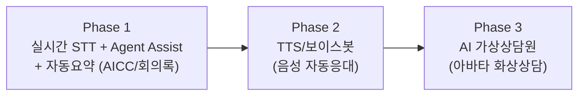

# 01. 제품 기획서 — VisionAI 음성 AI 플랫폼

## 1. 제품 정의

| 구분 | 내용 |
|------|------|
| 제품 유형 | 실시간 음성/텍스트 AI 플랫폼 (폐쇄망 온프레미스 설치형 + SaaS 구독형) |
| 1차 고객 | 금융사 콜센터(AICC), 공공기관(스마트 회의록), BPO/컨택센터 |
| 2차 고객 | 기업 회의록·교육, 병원·이커머스 CS, 무인창구/키오스크 |
| 핵심 가치 | ① 상담 품질·컴플라이언스 실시간 통제 ② 상담/회의 후처리 자동화 ③ 폐쇄망에서 도입 가능한 완전 온프레미스 ④ **블록 단위 부분 도입 → 단계적 확장** |

### 제품 진화 단계

세 단계 모두 동일한 블록 코어(VAD·STT·필터·RAG·sLLM)를 공유하며, 단계 확장 = 블록 추가다.
([00. 모듈 카탈로그](00-module-catalog.md) §3 조립 레시피 참조)

## 2. 시장 및 타겟

### 2.1 왜 금융 AICC + 공공 회의록인가

- 링버스는 현대해상 미래아키텍처 컨설팅 등 금융권 IT 도메인 지식·네트워크 보유
- 금융 AICC: 완전판매·필수고지 등 **컴플라이언스 실시간 모니터링** 수요가 강하고, 망분리 규제로
  글로벌 SaaS 도입이 어려움 → 폐쇄망 대응 국내 솔루션의 구조적 기회
- 공공 회의록: 회의록 작성 의무·속기 비용 문제가 명확하고, 공공 조달(나라장터·GS인증)로
  반복 판매 가능한 시장. AICC와 **동일 음성 코어를 재사용**하므로 한 번의 개발로 두 시장 대응

### 2.2 세그먼트별 공급 형태

| 세그먼트 | 공급 형태 | 특징 |
|----------|-----------|------|
| 대형 금융사 | **온프레미스** (폐쇄망) | 보안심사, 기간계 연동, 채널 수 대형 라이선스 |
| 공공기관 | **온프레미스** (단일노드 K8s) | GS인증, 조달 등록, 표준 패키지 반복 판매 |
| 중형 금융/GA·BPO | 온프렘 소형(S) 또는 **SaaS** | 비용 민감, 블록 부분 도입 |
| 일반 기업 | **SaaS** | 회의록·CS 요약 중심, 셀프 온보딩 |

### 2.3 차별화

| 경쟁 유형 | VisionAI 차별점 |
|-----------|-----------------|
| 글로벌 CCaaS/STT API | 완전 폐쇄망 동작(외부 호출 0건), KCMVP·국내 규제 준수, 한국어 최적화 |
| 국내 STT/회의록 솔루션 | 실시간 Agent Assist(1초 미만 지식 팝업) + sLLM 요약까지 단일 플랫폼, 아바타 확장 로드맵 |
| SI 구축형 | **레고블록 표준화로 구축 기간·비용 절감**, 블록 단위 견적 투명성, 업셀 = 라이선스 재발급 |

**포지셔닝 한 줄**: "규제 산업 폐쇄망에서 실제로 도입 가능한, 블록처럼 조립·확장하는 음성 AI 플랫폼"

## 3. 상품 구성 (블록 패키지 기반)

### 3.1 판매 상품

| 상품 | 구성 | 주 타겟 |
|------|------|---------|
| **패키지 A: 금융 AICC** | 실시간 STT + 컴플라이언스 필터 + Agent Assist(RAG 팝업) + 자동요약 + 상담원 UI | 금융 콜센터 |
| **패키지 B: 스마트 회의록** | STT + 화자분리 + 회의록/안건/Action Item 자동화 + 회의록 UI | 공공·기업 |
| **패키지 A+B 통합** | 블록 공유로 통합 할인 구조 | 금융지주, 대형 공공 |
| **패키지 C: AI 가상상담원** | A + TTS/보이스봇 + 아바타 (애드온) | 무인창구·키오스크 |
| **개별 블록** | 예: STT 엔진 단독 공급(API), 컴플라이언스 필터 단독 | 기존 인프라 보유 고객 |

- 부분 도입 → 확장 경로가 핵심 영업 논리: "필터만 먼저" → "Assist 추가" → "요약 추가" → "아바타"
- 각 확장은 `.lic` 재발급 + (필요시) 해당 블록 이미지 반입만으로 완료

### 3.2 가격 체계

| 상품 | 과금 방식 | 가격 가이드(초안) |
|------|-----------|-------------------|
| 온프레미스 구축 | 블록별 개발비(견적 라인) + 블록 라이선스(채널/시트/시간 단위) + 유지보수 15~20%/년 | AICC 100ch 기준 총 3억~8억원대 |
| SaaS Standard | 월 구독: 블록 토글 + 사용량(오디오 시간·시트) | 시트당 월 5~9만원 + 종량 |
| SaaS Enterprise | 연간 계약, 전용 테넌트, SLA | 연 3천만~1억원 |
| 개발 용역 | 커스터마이징(기간계 연동 어댑터, 전용 룰셋, 전용 음색/아바타) MM 단가 | 별도 산정 |

블록별 상세 청구 단위·견적 템플릿은 [00. 모듈 카탈로그](00-module-catalog.md) §4 참조.

### 3.3 Go-to-Market

1. **레퍼런스 확보기**: 금융권 컨설팅 고객망에 AICC PoC(Agent Assist — 상담원 보조라 도입 리스크 낮음). 병행으로 공공 회의록 GS인증·조달 준비
2. **온프렘 앵커 + SaaS 확산**: 대형 레퍼런스 → 중소형 SaaS 영업. 회의록 패키지는 조달 반복 판매
3. **아바타 차별화기**: 패키지 C로 무인창구·키오스크 시장 선점, 기존 고객 업셀

## 4. 로드맵

| 시기 | 마일스톤 | 내용 (Wave = [00 카탈로그](00-module-catalog.md) §5) |
|------|----------|------|
| M1~M3 | **음성 코어** (Wave 1~2) | 스트리밍 STT 실시간 자막 데모 — 사양서 Phase 1 |
| M4~M6 | **지능 블록** (Wave 3) | 필터 + RAG + Agent Assist 1초 파이프라인 — 사양서 Phase 2 |
| M7~M9 | **제품화** (Wave 4~5) | AICC·회의록 패키지 완성, 어드민/MLOps — 사양서 Phase 3 |
| M10~M12 | **패키징·출시** (Wave 6) | 에어갭 번들, DRM, GS인증 준비, PoC 1~2곳 — 사양서 Phase 4 |
| Y2 상반기 | **보이스봇** (Wave 7 전반) | TTS·자동응대, SaaS 정식 오픈 |
| Y2 하반기 | **아바타 베타** (Wave 7 후반) | 가상상담원 파일럿(키오스크/웹) |

## 5. KPI

| 구분 | 지표 | 1차년도 목표(안) |
|------|------|------------------|
| 제품 | Assist 팝업 지연 (STT→팝업) | < 1초 (p95) |
| 제품 | 팝업 채택률(상담원이 참조/사용) | 50% 이상 |
| 제품 | 요약 채택률(수정 없이 사용) | 70% 이상 |
| 사업 | PoC → 유료 전환 | 2건 이상 |
| 사업 | 온프렘 구축 레퍼런스 | 금융 1 + 공공 1 |
| 운영 | SaaS 가동률 | 99.9% |
