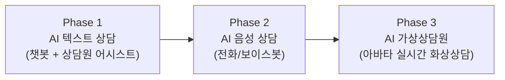

# 01. 제품 기획서 — VisionAI B2B AI 상담 플랫폼

## 1. 제품 정의

**VisionAI**는 기업의 고객 상담 업무를 AI로 자동화·보조하는 B2B 플랫폼이다.

| 구분 | 내용 |
|------|------|
| 제품 유형 | AI 상담 플랫폼 (설치형 온프레미스 + 구독형 SaaS) |
| 1차 고객 | 보험사, GA(법인보험대리점), 금융사 콜센터, BPO/컨택센터 운영사 |
| 2차 고객 | 공공기관 민원상담, 병원 예약상담, 이커머스 CS |
| 핵심 가치 | ① 상담 자동화율 향상(비용 절감) ② 24/365 무중단 상담 ③ 상담 품질 표준화 ④ 규제 환경(망분리)에서도 도입 가능 |

### 제품 진화 단계

- **Phase 1 — AI 텍스트 상담**: 웹/모바일 채팅 상담봇 + 인간 상담원용 실시간 어시스트(답변 추천, 상담 요약, 지식 검색)
- **Phase 2 — AI 음성 상담**: 전화 채널 연동(STT/TTS), 보이스봇, 통화 실시간 분석
- **Phase 3 — AI 가상상담원**: 아바타가 화면에서 얼굴을 보고 상담을 진행. 립싱크·표정·제스처 포함 (상세: [04. AI 가상상담원 확장 설계](04-ai-avatar-counselor.md))

세 단계 모두 **동일한 코어(대화 엔진 + RAG 지식베이스 + 상담 이력 관리)**를 공유하며, 채널(텍스트→음성→영상)만 확장된다. 이것이 본 플랫폼의 핵심 설계 원칙이다.

## 2. 시장 및 타겟 분석

### 2.1 왜 금융·보험권인가

- 링버스가 현대해상 미래아키텍처 컨설팅 등으로 확보한 **도메인 지식·레퍼런스·네트워크**
- 보험은 상담 집약 산업: 가입 상담, 보상(클레임) 접수, 계약 변경, 완전판매 모니터링 등 상담 볼륨이 크고 정형화되어 있어 AI 적용 ROI가 높음
- 금융권은 망분리·감독규정 때문에 글로벌 SaaS(순수 클라우드) 제품 도입이 어려움 → **온프레미스를 지원하는 국내 사업자에게 구조적 기회**

### 2.2 타겟 세그먼트별 공급 형태

| 세그먼트 | 규모 | 공급 형태 | 특징 |
|----------|------|-----------|------|
| 대형 보험사/은행 | 상담원 수백~수천 명 | **온프레미스** (또는 금융 전용 클라우드) | 망분리, 내부 기간계 연동, 보안심사, 장기 계약 |
| 중형 금융사/GA | 상담원 수십~수백 명 | 온프레미스 or **프라이빗 SaaS** | 비용 민감, 일부 클라우드 허용 |
| BPO/일반 기업 CS | 상담원 수~수십 명 | **SaaS** | 빠른 도입, 월 구독, 셀프서비스 온보딩 |

### 2.3 경쟁 구도와 차별화

| 경쟁 유형 | 예시 | VisionAI 차별점 |
|-----------|------|-----------------|
| 글로벌 CCaaS/AI | 클라우드 전용 대형 플랫폼 | 망분리 대응 온프레미스, 국내 규제 준수, 한국어 최적화 |
| 국내 챗봇 솔루션 | 시나리오 기반 챗봇 SI | LLM+RAG 기반 자연 대화, 아바타 확장 로드맵, 하이브리드 배포 |
| 대기업 AI 사업부 | 통신사/포털 계열 | 중형 시장 대응력, 커스터마이징 유연성, 컨설팅 연계 도입(설계→구축→운영 원스톱) |

**핵심 차별화**: "규제 산업에서 실제로 도입 가능한(deployable) AI 상담" — 온프레미스 로컬 LLM 구성으로 데이터가 외부로 나가지 않는 구조를 제공하면서, 동일 제품을 SaaS로도 판매.

## 3. 핵심 기능 정의

### 3.1 Phase 1 기능 (MVP 범위 포함)

| 모듈 | 기능 | MVP |
|------|------|-----|
| **AI 챗봇** | LLM 기반 자연어 상담, 시나리오+생성형 하이브리드, 상담원 전환(핸드오프) | ✅ |
| **지식베이스(RAG)** | 문서 업로드(약관/FAQ/매뉴얼) → 자동 청킹/임베딩 → 근거 기반 답변(출처 표시) | ✅ |
| **상담원 어시스트** | 실시간 답변 추천, 상담 중 지식 검색, 상담 종료 후 자동 요약/분류 | ✅ (요약·추천) |
| **관리자 콘솔** | 테넌트/사용자 관리, 지식베이스 관리, 상담 이력 조회, 통계 대시보드 | ✅ (기본) |
| **채널 연동** | 웹 위젯, 카카오톡 상담톡, REST API | ✅ (웹 위젯) |
| **감사/보안** | 전체 대화 로그, 개인정보 마스킹, 권한 관리(RBAC) | ✅ (로그·마스킹) |

### 3.2 Phase 2 기능

- 전화(SIP/PBX) 연동 보이스봇: 실시간 STT → 대화 엔진 → TTS
- 통화 실시간 품질 분석(금지어, 필수 고지사항 체크 — 완전판매 모니터링)
- 아웃바운드 캠페인(해피콜 자동화)

### 3.3 Phase 3 기능

- 아바타 가상상담원: 실시간 화상 상담(WebRTC), 립싱크/표정, 감정 반영
- 키오스크/창구 모드: 지점 창구·무인점포용 대면형 상담
- 상세 설계는 [04 문서](04-ai-avatar-counselor.md) 참조

## 4. 비즈니스 모델

### 4.1 가격 체계

| 상품 | 대상 | 과금 방식 | 가격 가이드(초안) |
|------|------|-----------|-------------------|
| **SaaS Standard** | 소~중형 | 월 구독: 상담원 시트 + AI 대화량(세션) 종량 | 시트당 월 5~9만원 + 세션 종량 |
| **SaaS Enterprise** | 중형 | 연간 계약, 전용 테넌트(스키마 분리), SLA | 연 3천만~1억원 |
| **On-Premise** | 대형 금융사 | 초기 라이선스 + 연간 유지보수(라이선스의 15~20%) | 구축 3억~10억원 + 유지보수 |
| **구축/커스터마이징 용역** | 온프렘 고객 | 기간계 연동, 전용 시나리오 개발 (컨설팅 조직 시너지) | MM 단가 기준 |

- LLM 추론 비용은 SaaS에서는 원가에 포함해 세션 종량으로 회수, 온프레미스에서는 고객사 GPU 인프라 사용(원가 리스크 없음)
- 아바타(Phase 3)는 **애드온 모듈**로 별도 과금 → 기존 고객 업셀 경로

### 4.2 Go-to-Market

1. **레퍼런스 확보기**: 컨설팅 고객망(보험사)에 PoC 제안 — 상담원 어시스트(리스크 낮음)부터 진입
2. **온프렘 앵커 + SaaS 확산**: 대형사 온프렘 레퍼런스를 신뢰 근거로 중소형 SaaS 영업
3. **아바타 차별화기**: Phase 3 출시 후 "가상상담원" 키워드로 시장 선점 (창구 무인화, 지점 축소 트렌드 부합)

## 5. 로드맵

| 시기 | 마일스톤 | 내용 |
|------|----------|------|
| M1~M4 | **MVP 개발** | Phase 1 핵심(챗봇+RAG+어시스트+콘솔), SaaS 싱글 리전 배포 |
| M5~M6 | **PoC 1호** | 보험사/GA 1곳 PoC (SaaS 또는 소규모 온프렘), 피드백 반영 |
| M7~M9 | **온프렘 패키징** | Helm 에어갭 설치 패키지, 로컬 LLM 구성, 보안심사 대응 문서 |
| M10~M12 | **정식 출시 (GA)** | SaaS 공개 + 온프렘 1호 구축, Phase 2(음성) 개발 착수 |
| Y2 상반기 | **음성 상담 출시** | 보이스봇, 콜 인프라 연동 |
| Y2 하반기 | **아바타 베타** | 가상상담원 파일럿(키오스크/웹), 조기 고객 확보 |

## 6. 성공 지표 (KPI)

| 구분 | 지표 | 1차년도 목표(안) |
|------|------|------------------|
| 제품 | AI 단독 해결률(containment rate) | 40% 이상 |
| 제품 | 상담 요약 채택률(상담원이 수정 없이 사용) | 70% 이상 |
| 사업 | PoC → 유료 전환 | 2건 이상 |
| 사업 | 온프레미스 구축 레퍼런스 | 1건 |
| 운영 | SaaS 가동률 | 99.9% |
