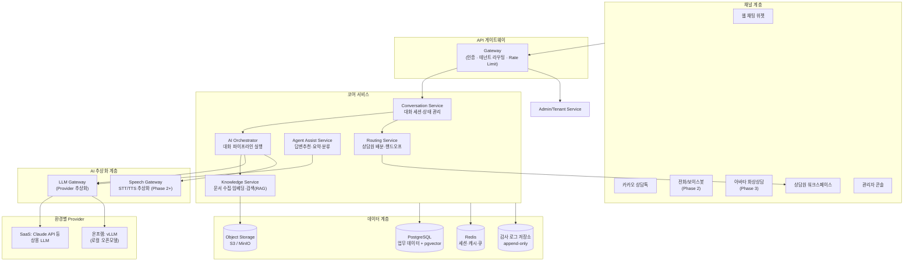
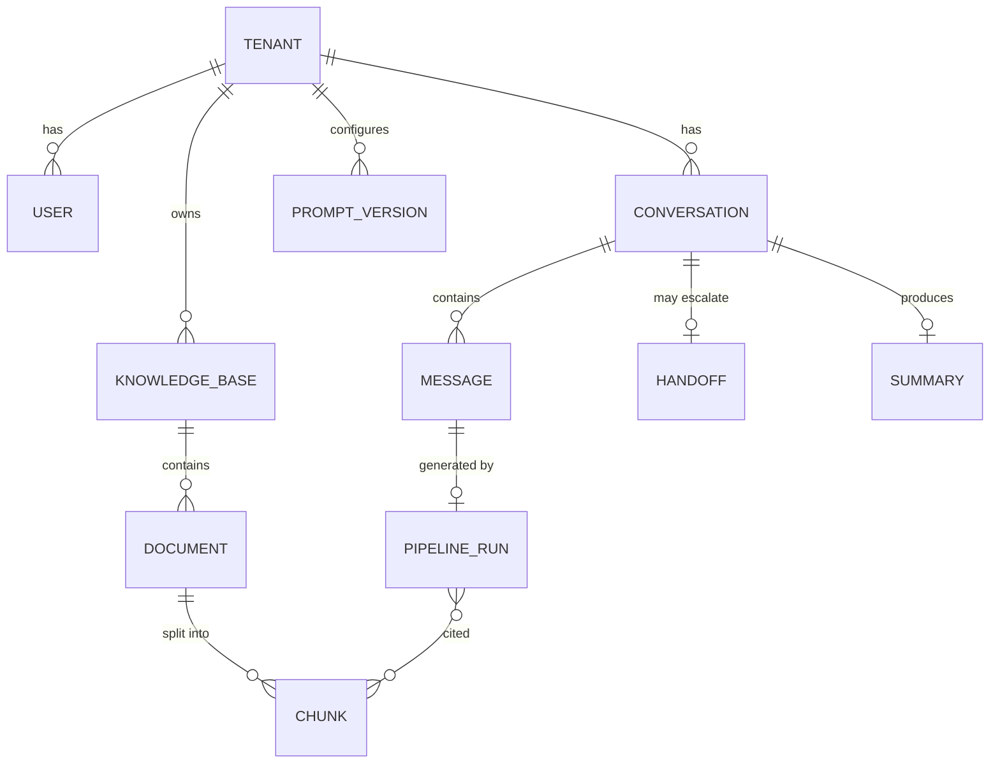

# 02. 시스템 아키텍처

## 1. 설계 원칙

1. **One Codebase, Two Deployments** — SaaS와 온프레미스는 동일 소스·동일 컨테이너 이미지. 차이는 설정(Helm values)과 어댑터 구현체로만 흡수한다. 별도 포크 금지.
2. **모든 외부 의존성은 추상화** — LLM, 임베딩, STT/TTS, 스토리지, 메시징은 인터페이스 뒤에 두고 환경별 구현체를 주입한다. 망분리 환경에서는 외부 API 호출이 0건이어야 한다.
3. **채널과 코어의 분리** — 텍스트/음성/아바타는 "채널 어댑터"일 뿐, 대화 처리 코어는 하나다. Phase 3 아바타는 채널 추가이지 재개발이 아니다.
4. **테넌트 우선(tenant-first)** — 모든 데이터 접근 경로에 tenant_id가 강제되는 구조. 온프레미스는 "테넌트 1개짜리 배포"로 동일 코드가 동작한다.
5. **감사 가능성(auditability)** — 모든 AI 응답은 입력·근거 문서·모델·프롬프트 버전과 함께 기록되어 재현 가능해야 한다(금융권 심사 대응).

## 2. 전체 아키텍처



## 3. 서비스 구성

MVP 단계에서는 **모듈러 모놀리스**(단일 배포 단위, 내부 모듈 경계 엄격)로 시작하고,
부하 특성이 다른 서비스부터 분리한다. 처음부터 마이크로서비스로 쪼개지 않는다.

| 서비스 | 역할 | 분리 시점 |
|--------|------|-----------|
| **api-core** | Gateway + Conversation + Routing + Admin (모놀리스 본체) | MVP부터 단일 서비스 |
| **ai-orchestrator** | 대화 파이프라인(전처리→RAG→LLM→후처리→가드레일) 실행 | MVP부터 분리 (LLM 대기시간이 길어 워커 특성이 다름) |
| **knowledge-worker** | 문서 파싱·청킹·임베딩 비동기 처리 | MVP부터 분리 (배치성 부하) |
| **llm-gateway** | Provider 추상화, 키 관리, 사용량 계측, 폴백 | MVP는 라이브러리로 시작 → 서비스로 승격 |
| **speech-service** | STT/TTS 스트리밍 | Phase 2 |
| **avatar-service** | 아바타 렌더링·립싱크·WebRTC | Phase 3 |

### 3.1 대화 처리 파이프라인 (AI Orchestrator)

```
사용자 발화
  → ① 전처리: 개인정보 탐지·마스킹, 언어 감지
  → ② 의도 분류: 시나리오 매칭(정형 업무) vs 생성형 응답(비정형 질의) vs 상담원 전환
  → ③ RAG 검색: 하이브리드(BM25 + 벡터) → 리랭킹 → 근거 문서 확보
  → ④ LLM 생성: 시스템 프롬프트(테넌트별 페르소나/정책) + 근거 + 대화 이력
  → ⑤ 가드레일: 답변 근거성 검증, 금지 주제 필터, 규제 문구(예: 투자권유 제한) 체크
  → ⑥ 후처리: 출처 표기, 액션 추출(예: 상담 예약 생성), 감사 로그 기록
```

- ②의 3분기 구조가 중요: 금융권은 "정확해야 하는 정형 업무"(해지환급금 조회 등)는 시나리오/API 호출로,
  "설명형 질의"(약관 문의)는 RAG 생성형으로 처리해 환각 리스크를 업무 유형별로 통제한다.
- 모든 단계는 `pipeline_run` 레코드로 기록 — 어떤 근거로 어떤 답이 나갔는지 재현 가능.

### 3.2 LLM Gateway (하이브리드 배포의 핵심)

```
인터페이스: complete(messages, tools?, tenant_ctx) / embed(texts, tenant_ctx)

Provider 구현체:
  - anthropic  : Claude API (SaaS 기본)
  - vllm       : OpenAI 호환 엔드포인트 (온프렘 로컬 모델 — 예: 한국어 특화 오픈모델)
  - azure/aws  : 고객사가 계약한 클라우드 LLM (프라이빗 엔드포인트)

기능:
  - 테넌트/환경별 Provider 바인딩 (SaaS: 공용 키풀, 온프렘: 로컬 엔드포인트 고정)
  - 사용량 계측(토큰) → 과금/쿼터
  - 타임아웃·재시도·폴백 체인 (예: 로컬 모델 장애 시 축소 응답 + 상담원 전환)
  - 프롬프트 버전 관리: 프롬프트는 코드가 아닌 버전된 리소스로 관리(테넌트 오버라이드 허용)
```

**모델 전략**: SaaS는 상용 API로 품질 우선. 온프레미스는 vLLM 서빙 기반 오픈 웨이트 모델을 GPU 사양별 프로파일(예: 소형 7~8B / 표준 30B급 / 고성능 70B급)로 패키징한다. RAG 품질이 좋으면 중형 모델로도 상담 품질 확보가 가능하다는 것을 전제로 하되, PoC에서 모델별 품질 벤치마크를 수행한다.

## 4. 멀티테넌시 설계

| 격리 수준 | 대상 | 방식 |
|-----------|------|------|
| **Row-level** (기본) | SaaS Standard | 단일 DB, 모든 테이블에 `tenant_id` + PostgreSQL RLS(Row Level Security) 강제 |
| **Schema-level** | SaaS Enterprise | 테넌트별 스키마 분리 (백업/복원 독립) |
| **Instance-level** | 온프레미스 | 고객사 인프라에 전체 스택 독립 배포 (tenant 1개) |

- 애플리케이션 계층: 요청 컨텍스트에서 `tenant_id`를 해석(JWT claim) → DB 세션 변수로 설정 → RLS가 이중 방어
- 벡터 검색(pgvector)도 동일 테이블 + RLS로 격리. Enterprise는 스키마별 인덱스
- 오브젝트 스토리지는 테넌트별 prefix + 서버측 암호화 키 분리
- **온프레미스도 멀티테넌시 코드를 그대로 사용** (tenant가 1개일 뿐) — 코드 분기 없음. 부수 효과로, 온프렘 고객이 계열사 다중 브랜드를 운영하는 경우 즉시 대응 가능

## 5. 데이터 모델 (핵심 엔티티)



| 엔티티 | 비고 |
|--------|------|
| `conversation` | 채널 무관 통합 세션(웹/카카오/전화/아바타 공용). `channel` 필드로 구분 |
| `message` | role(user/assistant/agent/system), 원문 + 마스킹본 분리 저장 |
| `pipeline_run` | AI 응답 1건의 전체 실행 기록: 모델, 프롬프트 버전, 인용 청크, 지연시간, 토큰 |
| `chunk` | 문서 조각 + 임베딩(pgvector). 문서 버전 관리로 "당시 어떤 약관으로 답했는지" 추적 |
| `handoff` | 상담원 전환 이벤트: 사유, 대기시간, AI가 생성한 전달 요약 |

## 6. 비기능 요구사항

| 항목 | 목표 |
|------|------|
| 응답 지연 | 챗봇 첫 토큰 2초 이내(스트리밍), 음성 왕복 1.5초 이내(Phase 2) |
| 동시성 | SaaS: 테넌트당 동시 세션 500, 전체 10k 세션 수평 확장 |
| 가용성 | SaaS 99.9% / 온프렘은 HA 구성 옵션(active-active 2노드+) |
| LLM 장애 대응 | Provider 폴백 → 실패 시 정중한 안내 + 상담원 전환 (무응답 금지) |
| 관측성 | OpenTelemetry 표준 — 온프렘 고객사 모니터링 체계에 수용 가능 |
| 국제화 | 1차 한국어, 구조는 다국어 리소스 분리 |

## 7. 기간계/외부 시스템 연동

금융권 온프레미스의 실제 도입 관문은 **기간계 연동**이다(고객 조회, 계약 조회, 접수 생성 등).

- **Integration Adapter 패턴**: 대화 중 필요한 업무 액션을 `tool` 인터페이스(함수 호출)로 정의하고,
  고객사별 어댑터(REST/SOAP/MCI/파일)로 구현. 코어는 어댑터 스펙만 알고 고객사 프로토콜을 모름
- 어댑터는 별도 배포 단위 → 고객사 SI 파트너 또는 링버스 컨설팅 조직이 구현 (용역 매출 연계 지점)
- 개인정보가 LLM 프롬프트에 들어가는 경로는 마스킹 정책 엔진을 반드시 경유
