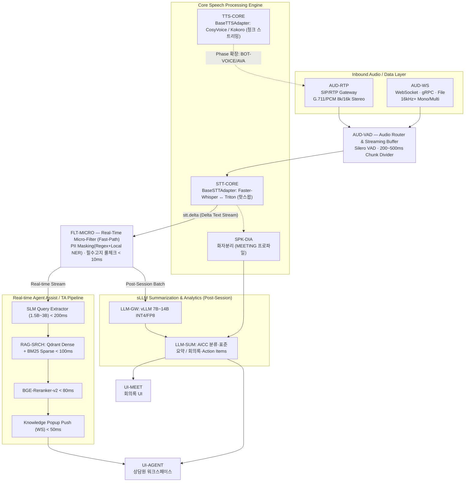
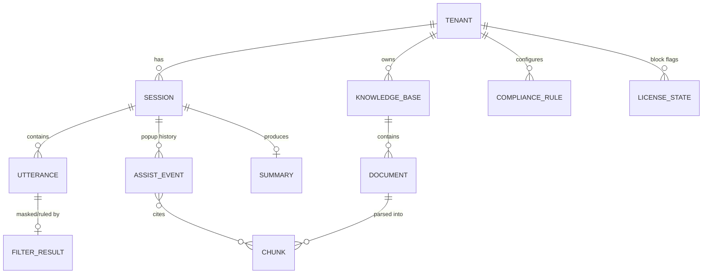

# 02. 시스템 아키텍처

> 기준 문서: 「온프레미스 실시간 다국어 STT/TTS & sLLM AI 플랫폼 개발 사양서 v1.0」
> 모든 컴포넌트는 [00. 레고블록 모듈 카탈로그](00-module-catalog.md)의 블록 계약을 따른다.

## 1. 설계 원칙

1. **레고블록 조립(Composable Blocks)** — 모든 기능은 독립 배포·독립 과금 가능한 블록. 블록 간 결합은 이벤트 버스 토픽과 OpenAPI 계약으로만. 제품 패키지는 `bundle.yaml` 조립 정의서로 구성
2. **Model-Agnostic Abstraction** — STT/TTS/sLLM 모델 코드는 서비스 로직에 종속되지 않는 어댑터(ABC) 패턴. 엔진 교체는 어댑터 플러그인 추가로 해결(핫스왑)
3. **Dual-Profile Processing** — 동일 파이프라인이 두 프로파일을 동시 지원:
   - `AICC`: 초저지연, Stereo/RTP, 실시간 감지·팝업
   - `MEETING`: 고정밀, Mono/File, 화자분리·요약
4. **Sub-Second Pipeline** — STT 수신 → sLLM/RAG 지식 팝업까지 전 과정 지연 1초 미만
5. **Fast-Path / Slow-Path 분리** — 컴플라이언스·마스킹은 sLLM을 거치지 않는 10ms 정규식 경로, 요약·분석은 세션 종료 후 배치 경로
6. **Complete Air-Gapped** — 폐쇄망에서 외부 호출 0건. H/W Fingerprint 오프라인 라이선스, KCMVP 암호화
7. **One Codebase, Two Deployments** — 동일 블록 이미지가 온프렘(로컬 엔진)과 SaaS(상용 API Provider)에서 설정만 바꿔 동작

## 2. 전체 아키텍처 (End-to-End)



## 3. 핵심 파이프라인 상세

### 3.1 실시간 스트림 경로 (AICC 프로파일) — 지연 예산 합계 < 1초

| 단계 | 블록 | 목표 Latency | 처리 내용 |
|------|------|--------------|-----------|
| 오디오 인입 | AUD-RTP | — | 고객/상담원 채널 분리(Stereo), PCM 정규화 |
| VAD·청킹 | AUD-VAD | 버퍼 200~500ms | 발화 구간 검출, 청크 분할, 백프레셔 |
| STT | STT-CORE | 스트리밍 Delta | `{text, is_final, confidence, speaker_id}` 이벤트 발행 |
| 마스킹·룰체크 | FLT-MICRO | **< 10ms** | PII 치환(`[RRN_MASKED]` 등), 필수 고지문구 매칭 → `matched_rules` |
| 질의 추출 | TA-ASSIST(SLM) | < 200ms | 최근 3문장 맥락에서 검색용 핵심 의도 문장 추출 |
| 하이브리드 검색 | RAG-SRCH | < 100ms | 의미 유사도(Dense) + 약관 조항/상품명(Sparse) 동시 |
| 리랭킹 | RAG-SRCH | < 80ms | 상위 10 후보 → 최종 3 청크 |
| UI 푸시 | CORE-GW(WS) | < 50ms | 참조 원문 + 추천 답변 팝업 렌더 |

### 3.2 배치 경로 (세션 종료 후)

```
session.closed 이벤트
  → LLM-SUM: 전체 대화(마스킹본) 로드
  → AICC: 상담 카테고리 분류 + 표준 요약 템플릿 생성
  → MEETING: 화자별 정리 + 안건/결정사항/Action Item 추출
  → summary.done 발행 → UI 반영 + 외부 시스템 webhook(옵션)
```

### 3.3 어댑터 인터페이스 (사양서 기준)

```python
# blocks/stt-core/adapters/base.py
class BaseSTTAdapter(ABC):
    @abstractmethod
    async def initialize(self, model_path: str, config: Dict[str, Any]) -> None: ...
    @abstractmethod
    async def transcribe_stream(
        self, audio_chunk: bytes, sample_rate: int = 16000
    ) -> AsyncGenerator[Dict[str, Any], None]:
        # yield {"text","is_final","confidence","speaker_id"}
        ...

# blocks/tts-core/adapters/base.py
class BaseTTSAdapter(ABC):
    @abstractmethod
    async def synthesize_stream(
        self, text_stream: AsyncGenerator[str, None], voice_id: str
    ) -> AsyncGenerator[bytes, None]:
        # 200ms 단위 PCM 청크 반환
        ...
```

- 어댑터 등록은 `block.yaml`의 entry-point 선언으로 플러그인 로딩 — 엔진 추가 시 코어 수정 없음
- 동일 패턴을 sLLM(LLM-GW: vllm/상용 API), 임베딩, 리랭커에 적용

## 4. WebSocket 통신 프로토콜 (`/v1/audio/stream`)

```jsonc
// Client → Server (Inbound Audio Chunk)
{
  "event": "audio_data",
  "session_id": "sess_20260731_001",
  "format": "pcm_16k",
  "channel": "customer",          // customer | agent | mic_N(회의)
  "audio_base64": "UklGRiQAAABXQVZF..."
}

// Server → Client (STT & Agent Assist Event)
{
  "event": "agent_assist_update",
  "session_id": "sess_20260731_001",
  "stt_result":  { "speaker": "customer", "text": "...", "is_final": true },
  "compliance":  { "pii_masked": false, "matched_rules": [] },
  "knowledge_popup": [{
    "doc_id": "doc_card_policy_012",
    "title": "신용카드 결제일 변경 및 연기 규정",
    "score": 0.92,
    "snippet": "...",
    "recommended_answer": "..."
  }]
}
```

- 이벤트 스키마는 `blocks/*/contracts/asyncapi.yaml`로 버전 관리(v1 네임스페이스), 하위 호환 유지

## 5. 멀티테넌시 & 하이브리드 배포

| 격리 수준 | 대상 | 방식 |
|-----------|------|------|
| Row-level | SaaS Standard | 단일 DB + `tenant_id` + PostgreSQL RLS |
| Schema-level | SaaS Enterprise | 테넌트별 스키마 (Qdrant는 테넌트별 컬렉션) |
| Instance-level | 온프레미스 | 고객사 폐쇄망에 전체 스택 독립 배포(tenant 1개, 동일 코드) |

환경별 차이는 어댑터/설정으로만 흡수:

| 관심사 | 온프렘 (폐쇄망) | SaaS |
|--------|-----------------|------|
| STT/TTS | 로컬 엔진(Faster-Whisper/CosyVoice), GPU | 로컬 서빙 풀 또는 상용 API 어댑터 |
| sLLM | vLLM 7B~14B (INT4/FP8) | 상용 LLM API(Claude 등) 어댑터 |
| Vector DB | Qdrant(번들) | Qdrant 매니지드/클러스터 |
| 라이선스 | CORE-LIC `.lic` 오프라인 검증 | 구독 DB + 미터링 |
| 텔레메트리 | 로컬 수집만 | 중앙 수집 |

## 6. 데이터 모델 (핵심 엔티티)



| 엔티티 | 비고 |
|--------|------|
| `session` | profile(AICC/MEETING), channel 구성, 시작/종료, 오디오 원본 참조(암호화 스토리지) |
| `utterance` | STT 결과(원문+마스킹본 분리), speaker, confidence, 타임코드 |
| `assist_event` | 팝업 1건의 전체 기록: 추출 질의, 인용 청크, 점수, 상담원 채택 여부 — **재현 가능 감사 기록** |
| `summary` | 유형(AICC 표준요약/회의록), 모델·프롬프트 버전, 편집 이력 |
| `compliance_rule` | 테넌트별 필수 고지/금지 표현 룰셋(정규식+메타), 버전 관리 |

## 7. 확장 경로: TTS → 보이스봇 → 아바타

Phase 1 사양(STT 중심 Agent Assist)에 이미 TTS-CORE 어댑터가 포함되므로:

1. **BOT-VOICE**: `stt.delta → 대화엔진 → TTS-CORE` 루프 연결로 보이스봇 구성 (신규 블록 1개)
2. **AVA-COUNSEL**: BOT-VOICE 파이프라인 앞에 WebRTC/립싱크/렌더러를 얹음 (상세: [04 문서](04-ai-avatar-counselor.md))

코어 파이프라인(VAD·STT·필터·RAG·sLLM)은 재사용되며, 확장은 항상 **블록 추가**로 이뤄진다.
