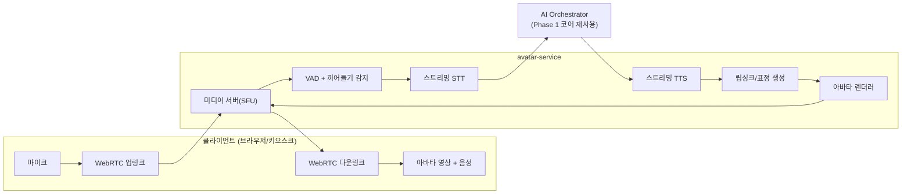

# 04. AI 가상상담원(아바타) 확장 설계 — Phase 3

## 1. 목표와 포지셔닝

**AI 가상상담원**: 화면 속 아바타가 고객과 얼굴을 마주하고 음성으로 실시간 상담을 진행하는 서비스.

| 제공 형태 | 시나리오 |
|-----------|----------|
| **웹 화상상담** | 고객이 웹/모바일에서 "화상 상담 시작" → 아바타 상담원과 대화 |
| **키오스크/창구** | 지점 무인창구, 공공기관 민원 키오스크 — 지점 축소·무인화 트렌드 대응 |
| **하이브리드 상담** | 아바타가 1차 응대 → 복잡 건은 인간 상담원 화상 연결(warm transfer) |

핵심 전제: **아바타는 채널이다.** 대화 지능(오케스트레이터·RAG·가드레일·상담이력)은 Phase 1에서 구축한 코어를 그대로 사용하고, Phase 3는 "입과 귀와 얼굴"(음성 왕복 + 시각 표현)을 추가한다.

## 2. 실시간 파이프라인

### 2.1 지연시간 예산 (목표: 발화 종료 → 아바타 응답 시작 1.5초 이내)

| 구간 | 예산 | 전략 |
|------|------|------|
| VAD 발화 종료 판정 | ~200ms | 세미틱 VAD(문장 완결성 추정)로 과대기 방지 |
| STT 최종화 | ~150ms | 스트리밍 STT — 발화 중 부분 결과를 미리 코어에 전달 |
| LLM 첫 토큰 | ~600ms | 짧은 시스템 프롬프트 + RAG 사전 검색(부분 STT 기반 선행 검색) |
| TTS 첫 오디오 | ~300ms | 문장 단위 스트리밍 합성 — 전체 응답 생성을 기다리지 않음 |
| 립싱크+렌더+전송 | ~250ms | 프레임 파이프라이닝 |

- **끼어들기(barge-in)**: 아바타 발화 중 사용자 음성 감지 시 즉시 TTS/렌더 중단 — 자연스러운 대화의 최소 조건
- **필러 응답**: LLM 지연이 긴 경우(기간계 조회 등) "네, 확인해 드릴게요" 류의 브리징 발화로 침묵 제거

### 2.2 아바타 렌더링 전략 (단계적 접근)

| 단계 | 방식 | 품질/비용 | 도입 시점 |
|------|------|-----------|-----------|
| **V1** | 3D 리깅 아바타(게임엔진/Three.js) + viseme 기반 립싱크 | 준수한 품질, GPU 부담 낮음, 클라이언트 렌더 가능 | 아바타 베타 |
| **V2** | 뉴럴 립싱크(오디오→얼굴 모션 모델) 서버 렌더 | 실사급, GPU 세션당 점유 | 정식 출시 |
| **V3** | 실사 디지털 휴먼(NeRF/Gaussian 계열) 또는 전문 벤더 제휴 | 최고 품질, 고비용 | 플래그십 고객 옵션 |

- V1은 **클라이언트 렌더링**(모션 데이터만 전송)이라 서버 GPU가 세션당 점유되지 않음 → SaaS 확장성에 유리. 키오스크도 로컬 렌더 가능
- V2부터 서버 렌더 세션당 GPU 비용이 발생 → 아바타 애드온 과금 근거
- 아바타 외형·목소리는 테넌트별 커스터마이징(기업 전속 상담원 캐릭터·유니폼·브랜드 보이스) — B2B 차별화 요소

### 2.3 표현 제어 (표정·감정·제스처)

- LLM 출력에 경량 마크업을 포함시켜 렌더러가 해석: 예) `<expr:smile>`, `<gesture:bow>`, 강조 억양 태그
- 감정 정책은 테넌트 설정(금융권: 절제된 표현 / 커머스: 친근한 표현)
- 고객 발화 감정 분석(음성 톤 + 텍스트) → 불만 고조 시 응대 톤 조정 + 상담원 전환 임계값 하향

## 3. 온프레미스 / SaaS 별 구성

| 구성요소 | SaaS | 온프레미스 |
|----------|------|-----------|
| STT | 상용 스트리밍 API 또는 자체 서빙(Whisper 계열 파인튜닝) | 자체 서빙 필수 (GPU) |
| TTS | 상용 API(고품질 한국어) | 로컬 TTS 모델 서빙 |
| 미디어 서버 | 관리형 또는 자체 SFU(LiveKit 등 오픈소스) | 자체 SFU — 미디어가 외부로 나가지 않음 |
| 렌더링 | V1 클라이언트 / V2 GPU 풀 | V1 권장 (키오스크 로컬 렌더) |

- Speech Gateway(02 문서)의 Provider 패턴을 그대로 적용 — 음성 스택도 환경별 교체 가능해야 함
- 온프렘 아바타는 GPU 사양표에 STT/TTS/렌더 부하를 합산해 프로파일 재산정 (음성 세션당 GPU 사용량이 챗봇 대비 큼)

## 4. 상담 UX 설계 원칙

1. **AI임을 명시**: 상담 시작 시 AI 가상상담원임을 고지(규제·신뢰). 화면에 상시 표기
2. **근거 동시 표시**: 아바타 발화와 함께 화면에 근거 문서·요약 카드 표시(음성만으로 전달 한계 보완). 키오스크에서는 서식·QR 표시
3. **언제든 사람에게**: "상담원 연결" 상시 버튼. 전환 시 AI가 상담 요약을 상담원에게 전달(고객이 같은 말을 반복하지 않게)
4. **본인확인 구간 분리**: 개인정보·본인확인은 별도 보안 위젯(키패드/인증)으로 처리, 음성으로 주민번호를 말하게 하지 않음
5. **녹취 고지**: 화상·음성 상담 녹취 동의 플로우 내장(금융권 필수)

## 5. 구현 로드맵

| 단계 | 기간(안) | 산출물 |
|------|----------|--------|
| **R&D 스파이크** | 4주 | 지연시간 PoC: WebRTC+STT+LLM+TTS 왕복 데모(아바타 없이 음성만), 1.5초 예산 검증 |
| **아바타 V1 알파** | +8주 | 3D 아바타 + viseme 립싱크, 웹 화상상담 데모, 끼어들기 |
| **베타 (파일럿)** | +8주 | 테넌트 커스터마이징(외형/보이스), 키오스크 모드, 상담원 전환, 파일럿 고객 1곳 |
| **GA** | +8주 | 온프렘 패키징(음성 스택 포함), 부하 테스트, 과금 연동 |

- Phase 2(음성 상담)의 STT/TTS/VAD 스택이 그대로 아바타의 기반이 되므로, **Phase 2 완료 시점에 아바타의 기술 리스크 대부분이 해소**되어 있어야 한다. R&D 스파이크는 Phase 2 기간 중 병행 수행
